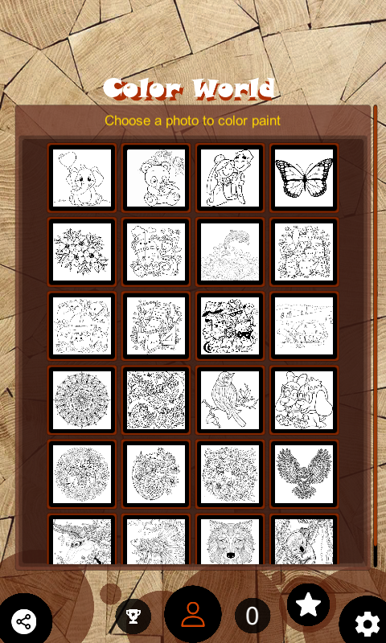

**Explore the World of Colors and Creativity with Color World!**  

Color World is a unique coloring app that blends fun and education, allowing you to unleash your creativity and enhance your coloring skills. With two exciting modes—**Simple Coloring** for filling large areas and **Detailed Coloring** using brushes or pens—you can choose the style that suits you best.  

### **Key Features of Color World:**  
- **Diverse Color Palette:** Mix and match shades to create your own unique colors, and save your favorite combinations for easy access later.  
- **Extensive Sketch Library:** From simple shapes to intricate designs, each sketch comes with helpful tips and guides to make learning new techniques effortless.  
- **Relaxing Music:** Carefully selected instrumental tracks help reduce stress and enhance focus. You can adjust the volume or turn the music off as you wish.  

### **User-Friendly and Inspiring:**  
- **Intuitive Interface:** Simple controls and an undo feature let you create with confidence.  
- **Progress Tracking:** Monitor your skill improvement with each coloring session.  

Whether you’re looking to relax, improve focus, or explore your artistic side, **Color World** is the perfect companion.  

**Download Color World today and start your colorful journey of creativity and relaxation!** 🎨

